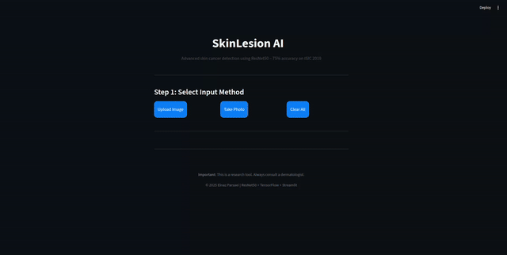
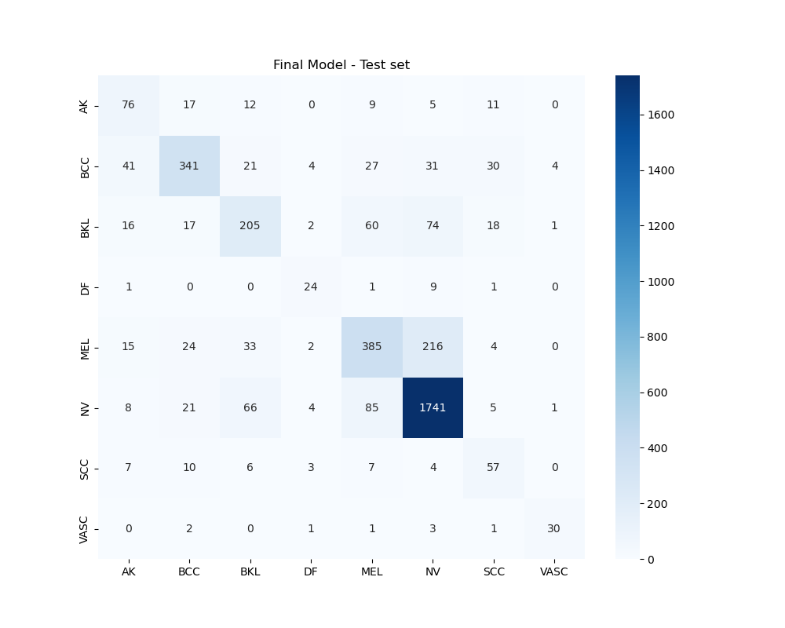

# Skin Cancer Classification using ResNet50 (ISIC 2019)
## Live Demo

  

## Why This Project Matters

Skin cancer is one of the most common cancers worldwide.  
**Early detection saves lives.**  
This project uses **deep learning** to classify 8 types of skin lesions with **75.0% accuracy** — matching top ResNet50-based models in research papers.

> **Important Note**: This is a **research project** and **must not** be used for real medical diagnosis without clinical validation.

---

## Dataset

- **Name**: ISIC 2019 (HAM10000 subset)  
- **Images**: 25,331  
- **Classes**: 8 (`AK`, `BCC`, `BKL`, `DF`, `MEL`, `NV`, `SCC`, `VASC`)  
- **Source**: [Kaggle - ISIC 2019](https://www.kaggle.com/datasets/salviohexia/isic-2019-skin-lesion-images-for-classification)  
- **Split**:  
  - Train: 70%  
  - Validation: 15%  
  - Test: 15% (stratified)

---

## Project Journey

| Stage | Techniques | Val Accuracy | Test Accuracy |
|------|-----------|--------------|---------------|
| 1. Transfer Learning | ResNet50 + Dense layers | ~56% | — |
| 2. Basic Fine-tuning | Unfreeze last 20 layers | **66.7%** | — |
| 3. **Advanced Fine-tuning** | 50 layers unfreeze + Strong Augmentation + Oversampling + Focal Loss | **74.9%** | **75.0%** |

---

## Model Architecture

python
ResNet50 (pretrained) → GlobalAveragePooling2D → Dense(512) → Dropout(0.5) → Dense(8, softmax)

- Unfreezed last 50 layers
- Optimizer: Adam(5e-6)
- Loss: Focal Loss (γ=2.0, α=0.25)
- Strong augmentation: rotation=40°, zoom, flip, brightness, etc.

### Final Results (Test Set)

#### Classification Report

| Class | Precision | Recall | F1-Score | Support |
|------|-----------|--------|----------|---------|
| AK   | 0.46      | 0.58   | 0.52     | 130     |
| BCC  | 0.79      | 0.68   | 0.73     | 499     |
| BKL  | 0.60      | 0.52   | 0.56     | 393     |
| DF   | 0.60      | 0.67   | 0.63     | 36      |
| MEL  | 0.67      | 0.57   | 0.61     | 679     |
| NV   | 0.84      | 0.90   | 0.87     | 1931    |
| SCC  | 0.45      | 0.61   | 0.52     | 94      |
| VASC | 0.83      | 0.79   | 0.81     | 38      |

**Accuracy**: 0.75  
**Macro Avg**: 0.65 / 0.67 / 0.66  
**Weighted Avg**: 0.75 / 0.75 / 0.75  
**Total Samples**: 3800

### Confusion Matrix

## Model Download (387 MB)
Due to GitHub file size limit, the model is hosted on Google Drive:

Download [best_final_model.keras](https://drive.google.com/drive/folders/1gacp-jpC_g23_uFP2FzoGY6-9itmvqFQ?usp=sharing)

## Future Improvements

- Use EfficientNetB3/B5
- Test-Time Augmentation (TTA)
- Ensemble multiple models
- Add lesion segmentation (ROI)
- Deploy as Streamlit web app

